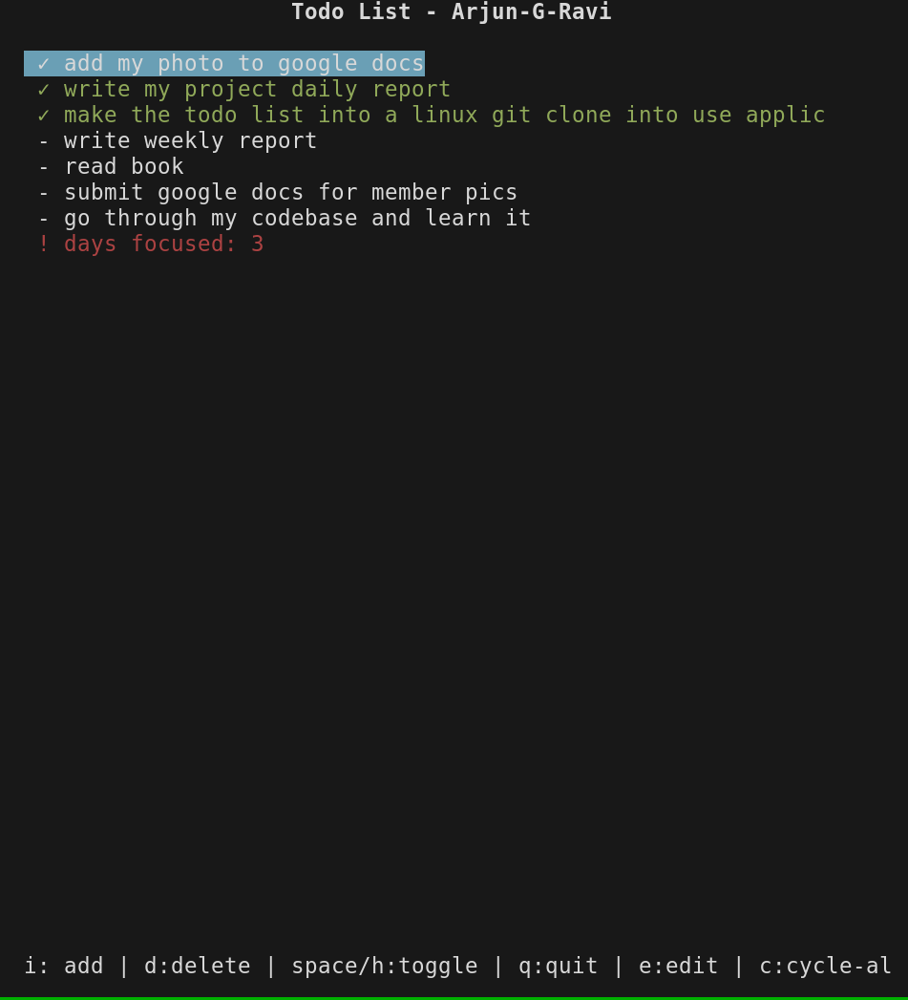

# terminal_todo

This is a terminal based lightweight todo list. It is easy to install, free to use, minimalistic and just works.

It is super easy to learn and use, just open it and all the shortcut will be at the bottom(just like nano)

It also has bindings which is simliar to vim-bindings. So vim users will find it more pleasureful to use.

At the same time, you need to know or use zero vim to use this.
# Installation(currently supports only debian based systems like Ubuntu and Linux Mint)

1. Download the `.deb` file:

`wget https://github.com/Arjun-G-Ravi/terminal_todo/raw/refs/heads/main/releases/python3-terminal-todo_0.1.0-1_all.deb`

2. Install the `.deb` file:

`sudo dpkg -i python3-terminal-todo_0.1.0-1_all.deb`

# Sample images

